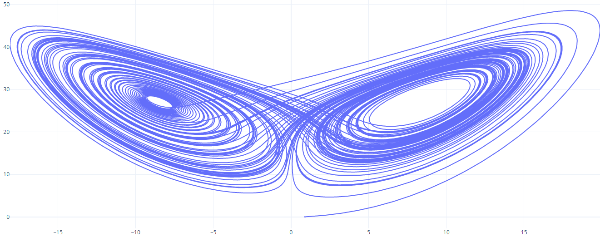

# Lorenz Attractor

## Description

The lorenz system is a set of ordinary differential equations. The lorenz attractor is the chaotic solution of this system.

## Lorenz equations

`X' = a * (Y - X)`

`Y' = X * (b - Z) - Y`

`Z' = X * Y - c * Z`

## Sample solution

With the parameters `a = 10.F`, `b = 28.F`, `c = 8.F/3.F` and a step size of `dt = 0.05F` within a range of `[0..2000]` the result is the lorenz butterfly.

```sh
./la > lorenz.csv
gnuplot graph.plt
```


