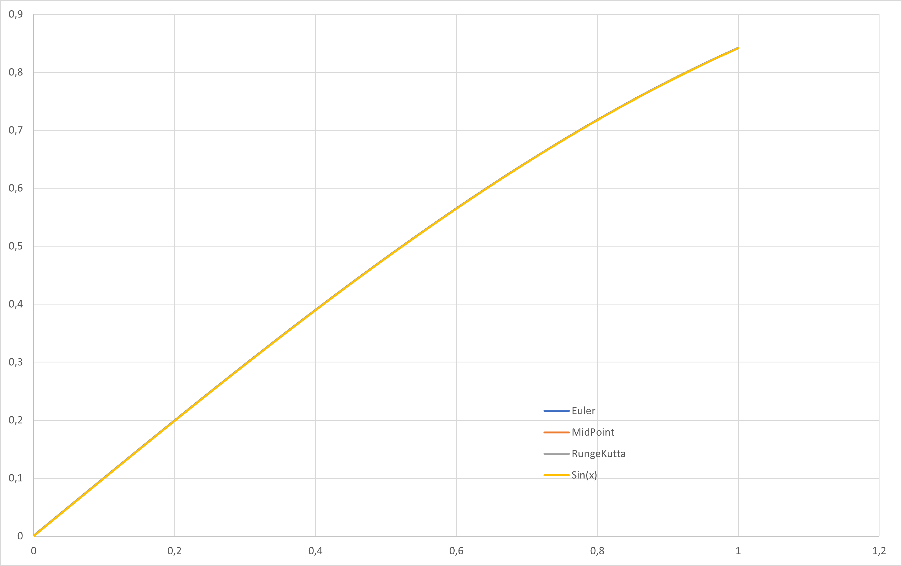

# Test

## Description

The test calculates `y(x)=sin(x)` by `dy(x)=cos(x)` in a range of `x=[0..1]` using the Euler, MidPoint and RungeKutta methods.

It returs -1 in case of a comparison didn't match with an accepted error of `e=0.0001`.

The additional commandline argument `--silent` blocks the result output. Just errors are printed to console.

## Results

